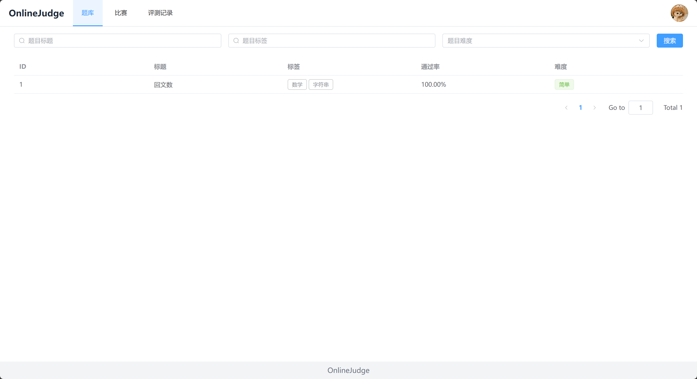
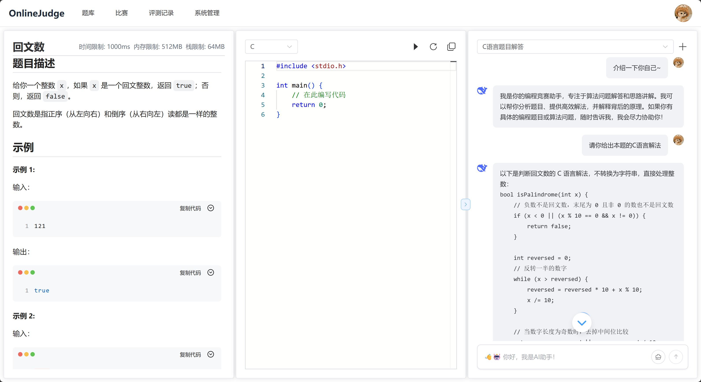
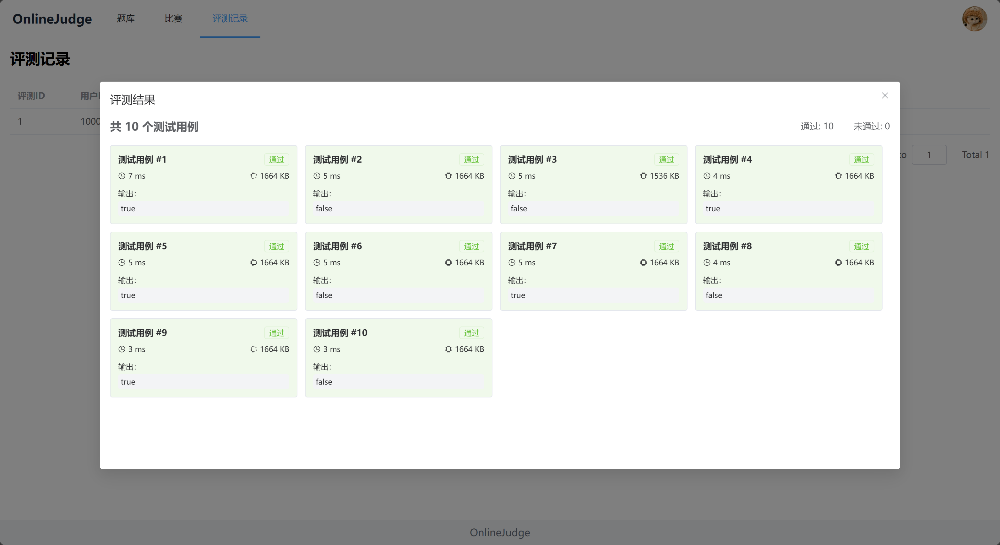
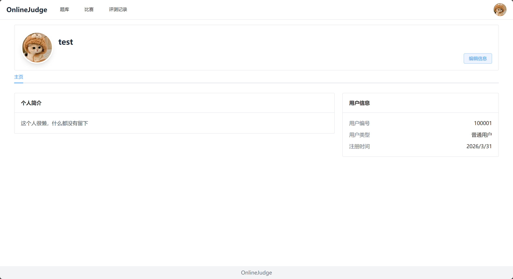
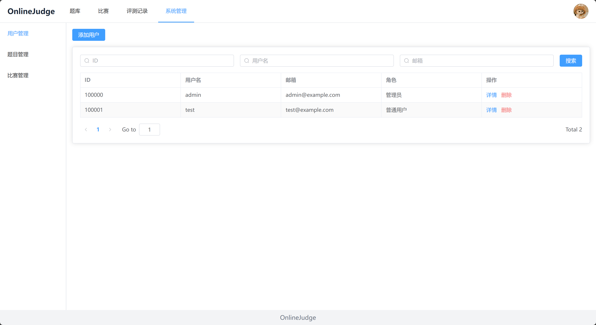

# OnlineJudge

一个基于 `Go + go-zero` 微服务架构实现的在线判题系统（Online Judge），集成 `Docker` 代码沙箱与 `DeepSeek` 大语言模型能力，前端基于 `Vue3 + TypeScript`。

## 项目亮点

- 微服务架构：网关 + 用户 + 题目 + 判题 + 比赛 + AI 子服务，服务间通过 gRPC 通信
- 安全判题沙箱：基于 Docker 隔离执行，支持 C/C++/Java/Python/Go/Rust 六种语言
- AI 辅助能力：题目上下文智能问答、未通过代码问题诊断（Code Check）
- 竞赛能力完整：支持 ACM / OI 两种赛制、报名与密码入场、排行榜
- 前后端分离：Vue3 前端 + go-zero 后端 + Python AI 服务

## 功能一览

1. 题库
- 创建与管理题目（管理员）
- 按标题/难度/标签检索题目
- 查看题目详情与判题配置

2. 评测
- 在线编写与提交代码
- 测试用例管理
- Docker 沙箱判题（C、C++、Java、Python、Golang、Rust）

3. 比赛
- 创建比赛、管理比赛（管理员）
- 参与比赛（支持可选密码）
- 支持 ACM / OI 赛制与排行榜

4. AI 辅助
- 智能问答（SSE 流式输出）
- 对无法 AC 的代码进行问题诊断

5. 数据看板
- 统计评测通过/未通过用例数量
- 识别错误类型（编译错误、运行时错误、超时、内存超限、栈溢出等）
- 结合历史评测记录查看提交结果变化

6. 用户
- 用户注册、登录、退出、刷新 Token
- 普通用户与管理员双角色
- 管理员可进行用户管理、题库管理、比赛管理
- 个人空间查看与编辑个人信息

## 项目截图

### 题库界面


### 做题界面


### 评测结果显示


### 个人空间


### 管理员界面


## 架构与技术栈

### 架构概览

```text
Frontend(Vue3)
   │ HTTP
   ▼
Gateway(go-zero REST)
   ├── gRPC ── User Service
   ├── gRPC ── Question Service
   ├── gRPC ── Judge Service ── Docker Sandbox
   ├── gRPC ── Competition Service
   └── HTTP ── AI Service(Flask + DeepSeek)
```

### 技术栈

- 后端：Go 1.24.1、go-zero、gRPC、Gorm、MySQL、Redis、etcd、JWT、MinIO
- AI 服务：Python、Flask、SQLAlchemy、OpenAI SDK（兼容 DeepSeek API）
- 前端：Vue3、TypeScript、Vite、Element Plus、Pinia、Monaco Editor
- 部署：Docker、Docker Compose、Nginx

## 快速开始（Docker 一键启动）

### 前置要求

- Docker / Docker Compose
- 可访问 DeepSeek（或兼容 OpenAI API）的网络环境

### 1. 克隆项目

```bash
git clone https://github.com/dwc-dev/OnlineJudge.git
cd OnlineJudge
```

### 2. 配置环境变量

编辑 `deploy/.env`，填写完整配置信息。

### 3. 一键启动

```bash
docker compose -f deploy/docker-compose.yml --env-file deploy/.env up -d --build
```

首次启动会自动下载相关镜像和构建判题沙箱镜像，耗时会略长。

### 4. 访问系统

- 前端入口：`http://localhost`
- API 前缀：`/api/v1`

### 5. 默认测试账号（来自初始化 SQL）

- 管理员：`admin@example.com` / `12345678`
- 普通用户：`test@example.com` / `12345678`

### 常用命令

```bash
# 查看日志
docker compose -f deploy/docker-compose.yml --env-file deploy/.env logs -f

# 停止并删除容器（保留数据卷可去掉 -v）
docker compose -f deploy/docker-compose.yml --env-file deploy/.env down -v
```

## 本地开发（可选）

- 启动 Go 服务（Windows）：`python backend/run.py`
- 启动 AI 服务：`python backend/microservices/ai/app.py`
- 启动前端：

```bash
cd frontend
pnpm install
pnpm dev
```

## 相关文档

- [项目架构介绍](docs/项目架构介绍.md)
- [Docker 部署说明](deploy/README.md)

## 目录结构

```text
backend/                     # Go 后端与代码沙箱
  gateway/                   # API 网关
  microservices/             # user/question/judge/competition/ai
  code-sandbox/              # Docker 判题沙箱
frontend/                    # Vue3 前端
deploy/                      # Docker Compose 与部署配置
docs/                        # 项目文档与截图
```

## License

本项目采用 [MIT License](LICENSE)。
